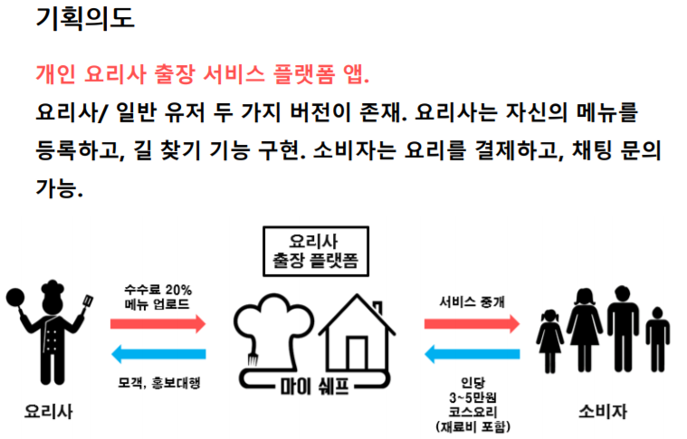
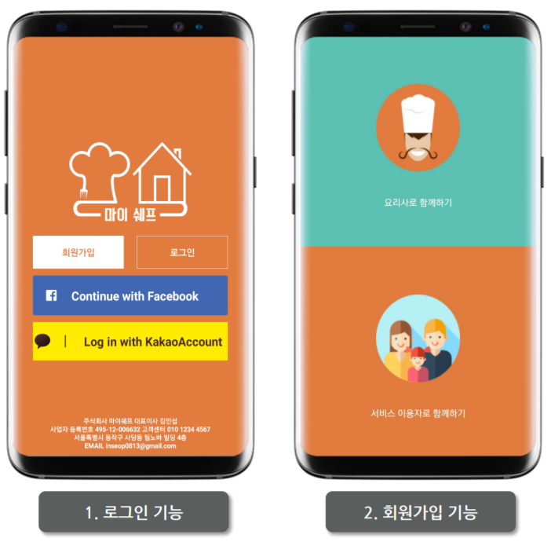
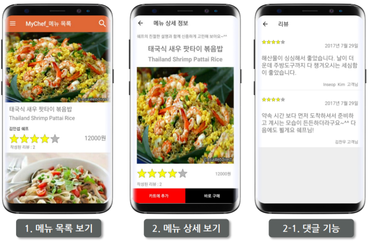
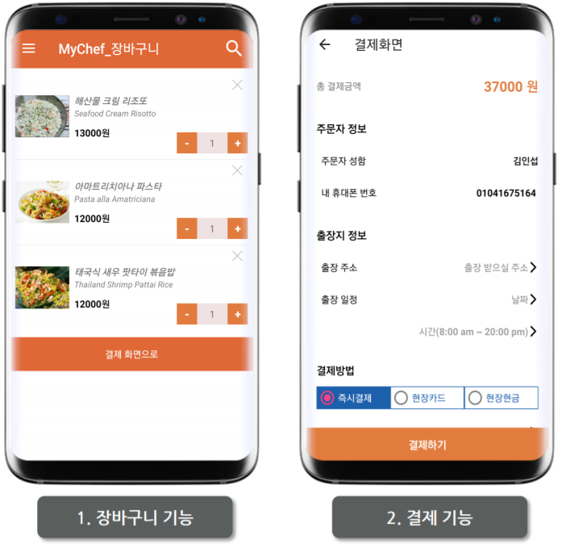
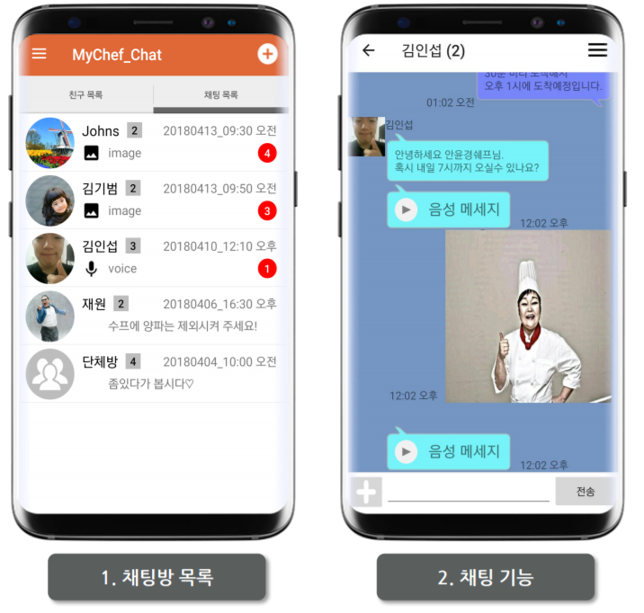

MyChef
===

## [서비스 설명]
요리사 출장 서비스 플랫폼

## [사용 기술]
- **웹서버**: Apache2
- **운영체제**: Android, Ubuntu
- **데이터베이스**: MySQL, SQLite
- **프로토콜**: TCP/IP, HTTP
- **주요 라이브러리/API**
 : Kakao Login API, Facebook Login API, GoogleMaps API, openCV, FCM
 
## [주요 기능]
#### 0. 인트로
앱의 주요 기능 설명.

#### 1. 로그인/회원가입
- 페이스북, 카카오톡 API
- 비밀번호 정규식 사용
- openCV 이용해 얼굴 검출이 확인된 사진만 사용 가능
- 요리사 / 일반 유저 두 가지 모드가 존재

#### 2. 메인 화면_유저
- 요리사가 올린 코스 메뉴 보기
- 실시간 및 최근 검색어
- 주문 내역 확인 가능
- 장바구니 기능
- 결제 기능
- 환경설정 기능 (알람 허용 여부 설정)

#### 3. 메인 화면_요리사
- 요리 주문 다이얼로그 알림
- 출장지역까지 길 안내
- 환경설정

#### 4. 채팅 기능
- 사진 및 오디오 보내기 가능
- 안 읽은 메세지 갯수 표시
- 방 나누기 구현

## [참고링크]
* [유튜브 - 앱 시현 영상](https://www.youtube.com/watch?v=jyjcpdQXAhs&t=8s)
* [깃허브 - 소스](https://github.com/Seopftware/MyChef)